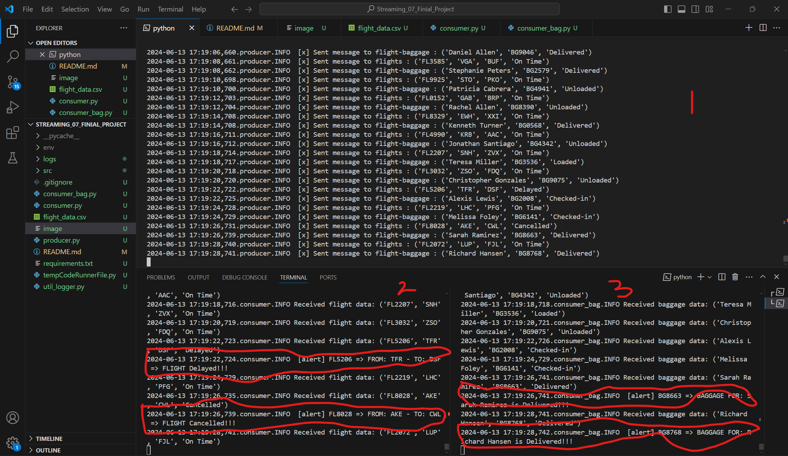

# Streaming_07_Finial_Project

## HANNA ANENIA
## 05/09/2024

## Introduction
This project demonstrates a producer-consumer pattern using RabbitMQ, where flight numbers are generated and sent to a queue by the producer, and the consumer reads these flight numbers and processes them. The consumer also includes an alert system to notify when specific conditions are met.

## Prerequisites
Before running this project, ensure you have the following installed:
Python 
RabbitMQ
Required Python libraries (pika, faker)
## Installation
1. Clone the repository:https://github.com/hanenia/Streaming_07_Finial_Project

2. Create and activate a virtual environment
python -m venv env
.\env\Scripts\activate

## Install the required Python packages:
pip install -r requirements.txt

## Usage
## Running the Producer
1. The producer generates flight numbers using the Faker library and sends them to the RabbitMQ queue.
Navigate to the producer directory:
2. Run the producer script:
3. Running the Consumer
3. consumer_bag.py
The consumer reads flight numbers from the RabbitMQ queue and processes them. It also contains an alert system that triggers based on specific conditions.

## Additional Files
-flight_data.csv: A CSV file containing sample flight data.
-util_logger.py: A utility for setting up logging.
-tempCodeRunnerFile.py: Temporary file created by the code editor.
-consumer_bag.py: An alternative or backup consumer script.

## Sreenshot 
![screenshot][def]
